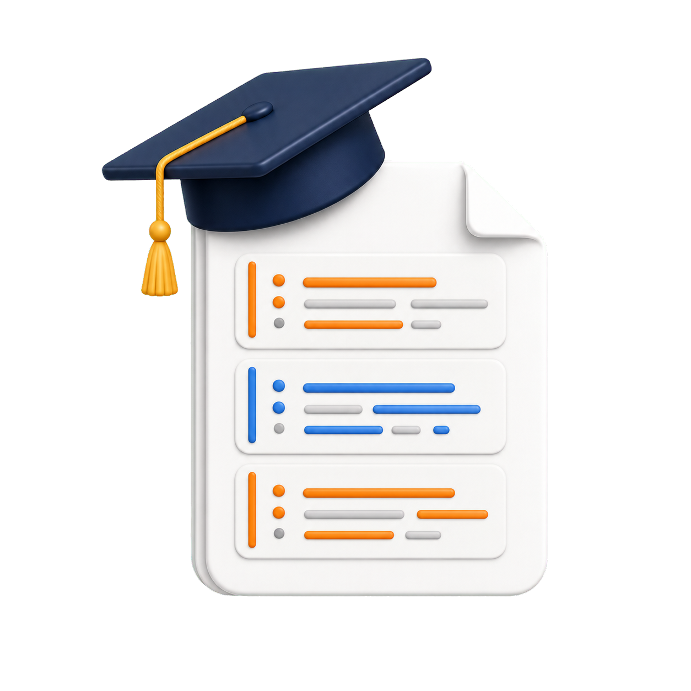

# Machine Learning con Python
## 2do Semestre 2026

🤝 [Apoyar este proyecto](https://vintabytes.github.io/apoyar/) · 🏠 [Volver al inicio del repositorio](../../README.md)

----

Este directorio reúne cuadernos Colab creados como material de apoyo para un recorrido introductorio de **Machine Learning con Python** del segundo semestre de 2026.

> **Estado del material:** curso en desarrolo. Los cuadernos se van agregando clase a clase.

El material está pensado para estudiantes que ya tienen una base inicial en Python y cierto contacto previo con el trabajo con datos usando Pandas. A partir de esa base, los cuadernos avanzan hacia la preparación de datasets, la división de datos, el entrenamiento de modelos, la evaluación de resultados y la comparación entre distintas técnicas de aprendizaje automático.

Este recorrido forma parte del repositorio general **Ciencia de Datos con Python**, pero tiene un objetivo específico: introducir los principales conceptos y procedimientos del machine learning supervisado y no supervisado mediante ejemplos prácticos en Google Colab.

---

## Sobre este recorrido

Los cuadernos están pensados para ser abiertos y ejecutados en **Google Colab**. Cada notebook combina explicación conceptual, código Python, análisis de salidas y comentarios sobre la interpretación de los resultados. El foco no está solamente en ejecutar modelos, sino también en comprender qué problema estamos resolviendo, qué decisiones tomamos durante el proceso y cómo evaluar si un modelo es adecuado.

En el curso se trabaja con modelos de regresión, clasificación y clustering. También se incorporan herramientas habituales del flujo de trabajo en machine learning, como partición de datos, validación cruzada, métricas de evaluación, pipelines y búsqueda de hiperparámetros. 

---

## Índice de contenidos
<table>
  <tr>
    <td valign="top" width="12%" align="center">
      
    </td>
    <td valign="top" width="38%">
      <strong>Clase 1 · Repaso de Pandas y formatos de archivos</strong>  
      <a href="https://github.com/VintaBytes/Ciencia-de-datos/blob/main/cursos/machine-learning-python2/Clase01/Lectura_archivos_con_Pandas.ipynb">Lectura de archivos con Pandas</a>  
      Este primer cuaderno presenta una aproximación inicial al trabajo con datasets en el contexto de machine learning. Se muestra como usar el entorno Colab y como cargar distintos tipos de archivos en un dataframe de Pandas.
    </td>
  </tr>
</table>

---

## Herramientas principales

A lo largo del recorrido se utilizaran principalmente:

* Python
* Google Colab
* Pandas
* NumPy
* Matplotlib
* Seaborn
* Plotly
* scikit-learn

También se trabajan conceptos generales de análisis exploratorio de datos, preparación de datasets, evaluación de modelos y comunicación de resultados.

---

## Requisitos sugeridos

Para aprovechar mejor estos cuadernos, conviene tener conocimientos básicos de:

* Sintaxis general de Python
* Listas, diccionarios y funciones
* Uso básico de Pandas
* Lectura e interpretación de tablas
* Nociones iniciales de gráficos y análisis exploratorio

No es necesario tener experiencia previa en machine learning. El recorrido introduce los conceptos principales de manera gradual.

---

## Autor, licencia y colaboración

Los materiales fueron desarrollados por **Ariel Palazzesi** y se publican como parte del proyecto **VintaBytes**.

- [Acerca del autor y del proyecto](ACERCA-DE.md)
- [Condiciones de uso y licencia](LICENSE.md)
- [Apoyar este proyecto](https://vintabytes.github.io/apoyar/)

[Volver al principio](#ciencia-de-datos-con-python)

